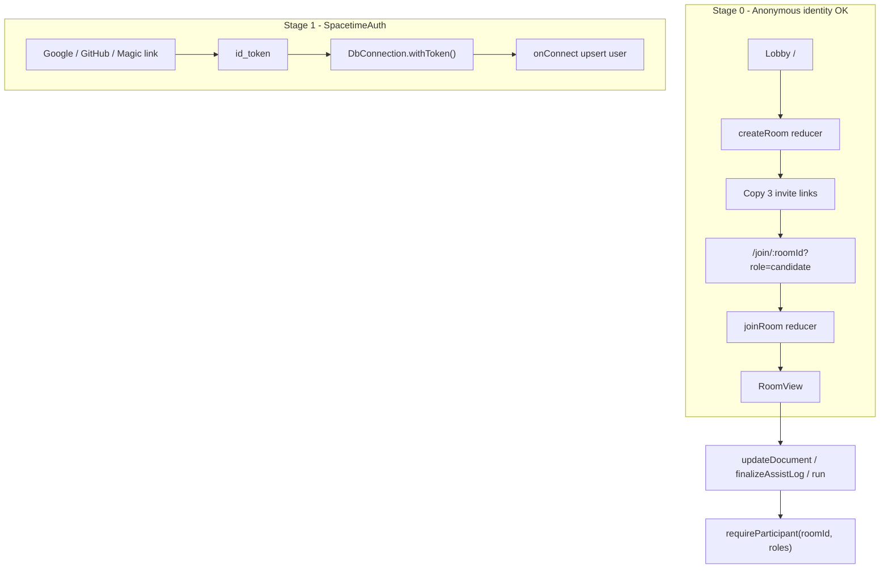

# Relay: Stage 0 → Stage 1 Plan

## Goal

Ship a **credible interview product** where a host creates a room, shares role-specific invite links, and **SpacetimeDB reducers enforce permissions**. Then add **SpacetimeAuth (OIDC)** so users have persistent identity across devices — without schema changes that block future P2P study rooms.

## Architecture (target state)



## Critical design decision: SpacetimeAuth roles vs room roles

Claude's SpacetimeAuth example uses **global JWT roles** (`jwt.fullPayload['roles']` → interviewer/candidate). **Do not use that for Relay.**

| Layer | Source | Purpose |
|-------|--------|---------|
| **Identity** | SpacetimeAuth JWT → `ctx.sender` | Who is connecting |
| **Profile** | `user` table (displayName, email from claims) | Lobby greeting, presence |
| **Room role** | `participant.role` set by **invite link + joinRoom validation** | candidate / interviewer / observer **per room** |

Why: the same person could be an interviewer in room A and an observer in room B. Global dashboard roles cannot express that.

SpacetimeAuth is used for **login only**; authoritative permissions stay in [`spacetimedb/src/index.ts`](relay/spacetimedb/src/index.ts) via `participant` + `room.kind`.

---

## Stage 0 — Real product without login (~6–8h)

### 0.1 Module schema ([`spacetimedb/src/index.ts`](relay/spacetimedb/src/index.ts))

Extend existing tables (additive migration — safe for Maincloud auto-migrate):

**`room`** — add columns:
- `kind: t.string()` — default `'interview'` (future: `'study'`)
- `policy: t.string()` — default `'syntax-only'` (`'open' | 'nudge-only' | 'syntax-only'`)

**`user`** — new table:
```typescript
user: table({ name: 'user', public: true }, {
  identity: t.identity().primaryKey(),
  displayName: t.string(),
  createdAt: t.u64(),
  // future: email, avatarUrl — additive
})
```

**`participant`** — add:
- `joinedAt: t.u64()` (optional but cheap)

After changes: `npm run spacetime:publish` + `npm run spacetime:generate`.

### 0.2 Permission helpers (module)

Add shared helpers at top of [`spacetimedb/src/index.ts`](relay/spacetimedb/src/index.ts):

```typescript
import { SenderError } from 'spacetimedb/server';

function findRoom(ctx, roomId) { ... }
function findActiveParticipant(ctx, roomId, identity) { ... }
function requireParticipant(ctx, roomId, allowedRoles: string[]) { ... }
function canEdit(ctx, roomId): boolean {
  const room = findRoom(ctx, roomId);
  const p = findActiveParticipant(ctx, roomId, ctx.sender);
  if (!p) return false;
  if (room.kind === 'interview') return p.role === 'candidate';
  // study branch deferred to Stage 2
  return false;
}
```

### 0.3 Reducer changes

| Reducer | Change |
|---------|--------|
| **`createRoom`** | Args: `{ title, kind?, policy? }`. Insert with `kind: 'interview'`, `policy` from host. Remove title-uniqueness no-op (allow multiple rooms). |
| **`joinRoom`** | Validate room exists. Validate role for `room.kind === 'interview'`: only `candidate \| interviewer \| observer`. Reject unknown roles. **One active candidate per room** — if `role === 'candidate'` and another active candidate exists (different identity), `throw new SenderError('Candidate seat taken')`. Upsert `user` row. Set `joinedAt`. |
| **`updateDocument`** | Guard: `if (!canEdit(ctx, roomId)) throw new SenderError('Not allowed to edit')` |
| **`finalizeAssistLog`** | Guard: active participant with `role === 'candidate'` only |
| **`appendRunOutput` / `clearRunOutput`** | Guard: candidate only |
| **`onConnect`** | Upsert thin `user` row if missing (displayName = identity hex fallback until joinRoom sets name) |

New reducer (optional but useful for host):
- **`setRoomPolicy({ roomId, policy })`** — interviewer only, in that room

### 0.4 Frontend routing and lobby

Split monolithic [`src/App.tsx`](relay/src/App.tsx) into:

| File | Responsibility |
|------|----------------|
| [`src/AppShell.tsx`](relay/src/AppShell.tsx) | Route by pathname (no new dep needed — use `window.location` or add `react-router-dom`) |
| [`src/Lobby.tsx`](relay/src/Lobby.tsx) | Title + policy picker → `createRoom` → show room id + 3 copyable invite links |
| [`src/Join.tsx`](relay/src/Join.tsx) | `/join/:roomId?role=candidate&name=` — name form if missing → `joinRoom` → redirect to room |
| [`src/RoomView.tsx`](relay/src/RoomView.tsx) | Current App UI; **no exported URL constants for role/policy** |

**Invite link format:**
```
/join/42?role=candidate&name=Alice
/join/42?role=interviewer&name=Bob
/join/42?role=observer
```

**RoomView derives permissions from subscription**, not URL:
```typescript
const myParticipant = participants.find(
  p => p.identity.toHexString() === myIdentity.toHexString() && p.active
)
const canEdit = myParticipant?.role === 'candidate'
const policy = currentRoom?.policy ?? 'syntax-only'
```

Remove from [`src/App.tsx`](relay/src/App.tsx) exports: `ROLE`, `POLICY`, `IS_CANDIDATE` URL pattern.

Update [`src/AssistPanel.tsx`](relay/src/AssistPanel.tsx):
- Accept `policy` from room (prop from RoomView)
- Accept `canAsk: boolean` — hide/disable input for non-candidates

Update [`src/main.tsx`](relay/src/main.tsx): unchanged anonymous token flow for Stage 0.

### 0.5 Backward compatibility for existing E2E

Existing tests in [`tests/e2e/phase1.spec.ts`](relay/tests/e2e/phase1.spec.ts)–[`phase6.spec.ts`](relay/tests/e2e/phase6.spec.ts) navigate to `/?role=candidate`.

**Migration path for tests:**
- Update [`tests/e2e/helpers.ts`](relay/tests/e2e/helpers.ts) `openRoom()` to:
  1. Create room via lobby OR call join URL `/join/{room}?role=...`
  2. Navigate to `/room/{roomId}` after join
- Add [`tests/e2e/phase9.spec.ts`](relay/tests/e2e/phase9.spec.ts):
  - Host creates room from lobby
  - Candidate link joins → can edit
  - Observer link joins → read-only
  - Second candidate link → shows "Candidate seat taken" error
  - Policy from room (not URL) affects assist downgrade

### 0.6 Deploy frontend (Stage 0 gate)

Separate Vercel project from `relay-api`:
- Build output: `dist`
- Env: `VITE_SPACETIMEDB_HOST`, `VITE_SPACETIMEDB_DB_NAME`, `VITE_API_URL`
- Add production URL to SpacetimeAuth redirect URIs (prep for Stage 1)

---

## Stage 1 — SpacetimeAuth OIDC (~3–5h after Stage 0)

Auth provider: **SpacetimeAuth** with **Google + GitHub** (and magic link for candidates who skip OAuth). Use identity from JWT; **do not** assign interview roles in SpacetimeAuth dashboard.

### 1.1 Maincloud dashboard setup (manual)

1. Maincloud → `relay-demo` module → **SpacetimeAuth** → Enable
2. **Clients**: add redirect URIs:
   - `http://localhost:5173/callback` (dev)
   - `https://<frontend-vercel-url>/callback` (prod)
3. **Identity providers**: enable Google, GitHub, magic link
4. Copy **client ID** → `VITE_OIDC_CLIENT_ID`

### 1.2 Frontend OIDC ([`src/main.tsx`](relay/src/main.tsx))

Add dependency: `react-oidc-context`.

```typescript
const oidcConfig = {
  authority: 'https://auth.spacetimedb.com/oidc',
  client_id: import.meta.env.VITE_OIDC_CLIENT_ID,
  redirect_uri: `${window.location.origin}/callback`,
  scope: 'openid profile email',
  response_type: 'code',
  automaticSilentRenew: true,
};
```

Wrap app in `AuthProvider`. Gate connection:

```typescript
// When VITE_AUTH_ENABLED=true (production):
const token = auth.user?.id_token;
DbConnection.builder()
  .withToken(token)
  ...
```

Add [`src/AuthGate.tsx`](relay/src/AuthGate.tsx):
- Loading → spinner
- Not authenticated → "Sign in" button (`auth.signinRedirect()`)
- Authenticated → render `AppShell`
- Handle `/callback` route (clear query params after sign-in)

**Env flags:**

| Var | Local dev | CI E2E | Production |
|-----|-----------|--------|------------|
| `VITE_AUTH_ENABLED` | `false` | `false` | `true` |
| `VITE_OIDC_CLIENT_ID` | — | — | from dashboard |

CI in [`.github/workflows/ci.yml`](relay/.github/workflows/ci.yml) keeps `VITE_AUTH_ENABLED=false` so Playwright stays on anonymous local STDB.

### 1.3 Module JWT handling ([`spacetimedb/src/index.ts`](relay/spacetimedb/src/index.ts))

Update `onConnect`:

```typescript
export const onConnect = spacetimedb.clientConnected((ctx) => {
  const jwt = ctx.senderAuth.jwt;
  if (jwt != null) {
    // Validate issuer + audience (client ID from env — use constant matching dashboard)
    if (jwt.issuer !== 'https://auth.spacetimedb.com/oidc') {
      throw new SenderError('Invalid issuer');
    }
    const name = jwt.fullPayload['name'] ?? jwt.fullPayload['preferred_username'] ?? jwt.subject;
    // upsert user row with displayName from claims
  }
  // jwt == null: allow for local E2E / anonymous dev (Stage 0 path preserved)
});
```

**Production hardening (optional follow-up):** once CI auth bypass is no longer needed, add strict `if (jwt == null) throw` — only safe when all clients require login.

### 1.4 Join flow with auth

Lobby and join pages pre-fill display name from `user.displayName` (subscription) or OIDC profile. `joinRoom` still sets **room role** from invite link — login does not replace invite semantics.

### 1.5 Stage 1 verification

Manual checklist:
1. Sign in with Google → land on lobby with name shown
2. Create room → copy candidate link → open in incognito → sign in as different user → join as candidate
3. Same identity reconnects on second device (same `user` row, new `participant` entry)
4. CI: `npm run test` still green with auth disabled

---

## What this unlocks for Stage 2 (P2P study — out of scope)

No schema rewrite needed. Later work is:
- Lobby button: `createRoom({ kind: 'study' })`
- `joinRoom` allows `host | member`
- One line in `canEdit`: `if (room.kind === 'study') return !!p`

---

## File change summary

| Area | Files |
|------|-------|
| Module | [`relay/spacetimedb/src/index.ts`](relay/spacetimedb/src/index.ts) |
| Frontend | [`relay/src/App.tsx`](relay/src/App.tsx) → split; [`relay/src/main.tsx`](relay/src/main.tsx); new Lobby/Join/RoomView/AuthGate |
| Assist | [`relay/src/AssistPanel.tsx`](relay/src/AssistPanel.tsx) |
| Tests | [`relay/tests/e2e/helpers.ts`](relay/tests/e2e/helpers.ts), new `phase9.spec.ts`, update phase1–6 URLs |
| CI | [`relay/.github/workflows/ci.yml`](relay/.github/workflows/ci.yml) — `VITE_AUTH_ENABLED=false` |
| Env | `.env.local` + Vercel env vars |

---

## Suggested implementation order

```mermaid
gantt
  title Relay Stage 0-1
  dateFormat X
  axisFormat %s

  section Stage0
  Schema_and_helpers     :0, 2
  Reducer_guards         :2, 4
  Lobby_Join_RoomView    :4, 7
  E2E_phase9             :7, 8
  Deploy_frontend        :8, 9

  section Stage1
  SpacetimeAuth_dashboard :9, 10
  OIDC_client_wiring      :10, 12
  onConnect_user_upsert   :12, 13
  Manual_auth_smoke       :13, 14
```



**Demo milestone:** end of Stage 0 (lobby + enforced roles + deployed frontend).  
**Account milestone:** end of Stage 1 (SpacetimeAuth login, same schema).

---

## Risks and mitigations

| Risk | Mitigation |
|------|------------|
| Maincloud migration breaks existing `relay-demo` rows | Additive columns with defaults; test publish to local first |
| OIDC breaks E2E | `VITE_AUTH_ENABLED=false` in CI; module allows anonymous connect when no JWT |
| Global SpacetimeAuth roles conflate with room roles | **Identity-only auth**; roles stay on `participant` |
| `createRoom` doesn't return id | Host finds new room via `createdBy === myIdentity`, latest `createdAt` |
| Existing phase tests fail on routing change | Update `helpers.ts` once; keep `/room/:id` as stable test target |
